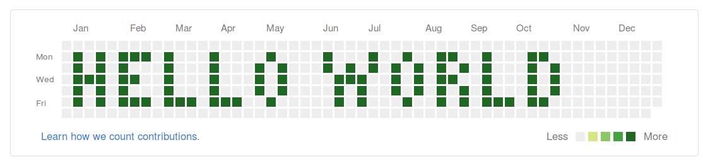

# github-punchline



**github-punchline:** A simple proof-of-concept for writing a message in Github's activity summary.

```
[...]
dateTopLeftCorner = dateTopLeftCorner - DD_year
# word to print
letters = [H,E,L,L,O, space, W,O,R,L,D];
#compose the list
grid = [];
[...]
```

interested ? read the blogpost: [https://lbarman.ch/blog/github-activity-map/](https://lbarman.ch/blog/github-activity-map/)
